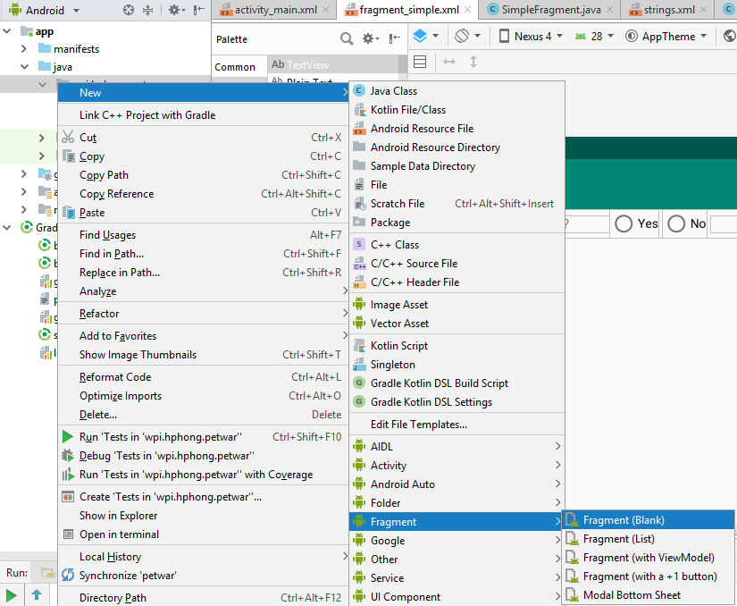
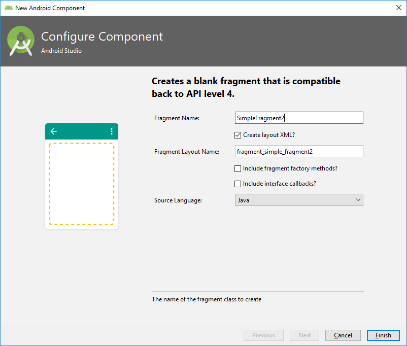
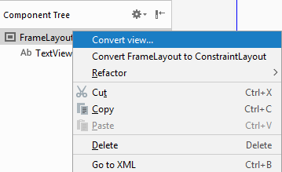
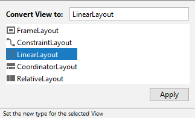
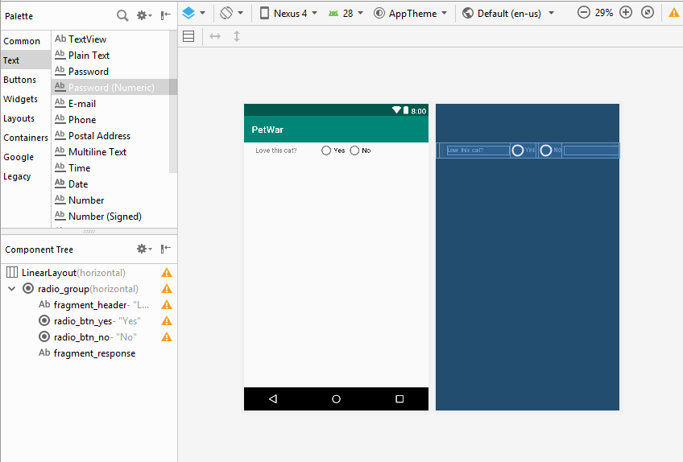
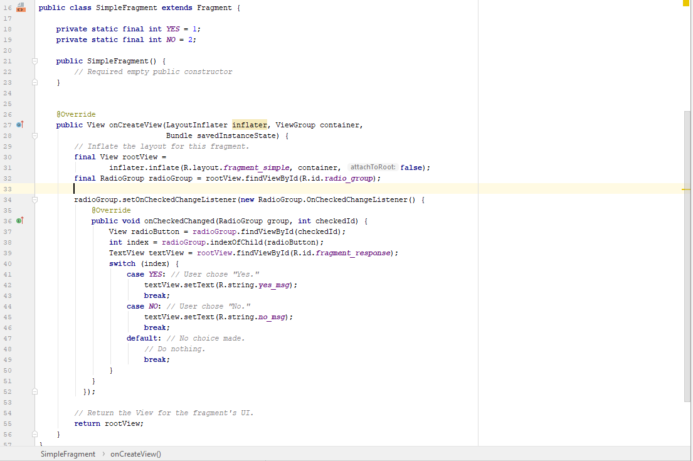
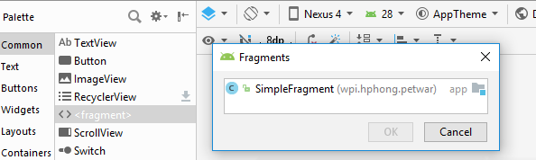
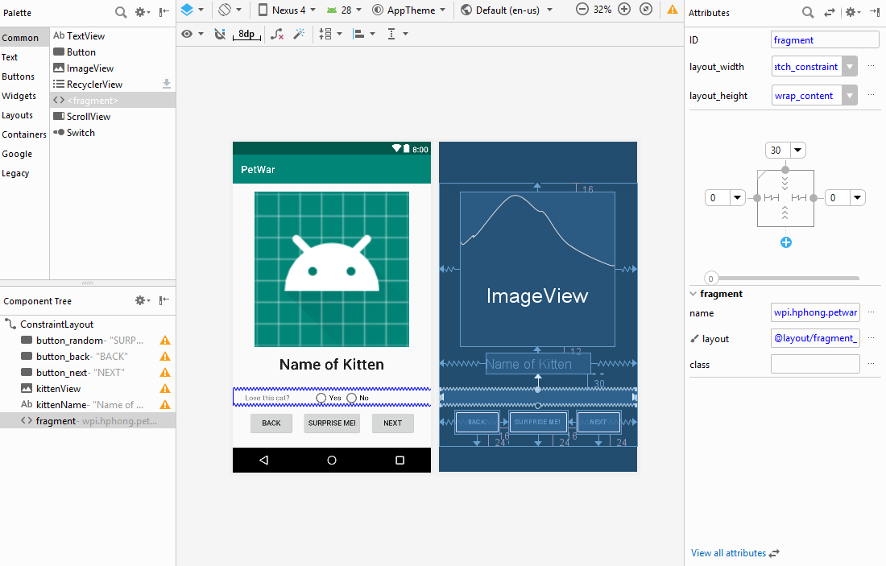
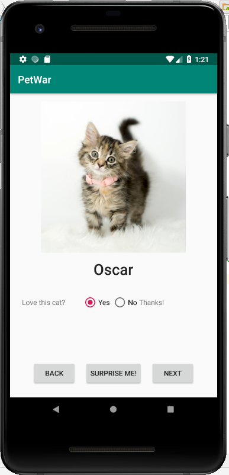

author: Hung Hong
summary: CS4518 Project 1 UI Mutation Tutorial
categories: Fragments
environment: java

# CS4518 Project 1 UI Mutation Tutorial
## Overview of Tutorial

This tutorial will show you how I proceed on redesigning the UI that we attain from Part 1 of Project 1. In this tutorial, we will be doing the following:

- Creating a fragment with a UI
- Extending the buttons
- Responsive text

Prerequisites:
- Complete Project 1 - Part 1
- AVD with API 27 or higher

## Add a Fragment

In the Project:Android pane which shows the contents of the project, expand **app > java** and select **wpi.your_user_name.petwar**. Choose **File > New > Fragment > Fragment (Blank)**.

In the Configure Component window, you can input the name of the fragment that you will implement. I name mine as *SimpleFragment*. The Fragment Layout Name will be filled automatically.

Remember to uncheck **Include fragment factory methods?** and **Include interface callbacks?** as we won't be using them for now. Hit **Finish** once you are done.

## Set up Fragment's Layout
After the fragment is created, we will need to change the layout of the fragment. Change **FrameLayout** to **LinearLayout** accordingly by right_click on **FrameLayout** and choose **Convert view...**

A small window will show up with different layouts. Choose LinearLayout.

## Preparing the UI
There are many ways you can play around with Fragments. For my implementation, I add in a RadioGroup with many radio buttons and some text views. Here is what the layout looks like:

In order to add these items, simply find the object from the **Palette** panel and drag-drop to the **Component Tree**. You can also change the properties accordingly to make it look neat. For my implementation, I want to allow the user to decide whether the user loves the kitten displayed by choosing between *Yes* or *No*.

## Make the UI meaningful

After you have successfully added the objects to the fragment layout, you can start giving these some functionalities by some codes. In my case, I want to have a comment text appearing next to the choice accordingly. Here is the code example for my implementation:

Your code should go into **onCreateView()** and match with the id that you give to the items in the Fragment layout. What I did is I give some interaction whenever *Yes* or *No* is chosen. (*Yes* is index 1 in *radio_group*, *No* is index 2 in *radio_group*)

## Fragments and More Stuffs!
Go back to your **activity_main.xml** and add **<fragment>** from **Palette panel > Common**. Choose **SimpleFragment** from the pop-up window. 

Make sure you give constraints to this fragment to fit on the layout accordingly. You should have something similar to this:

Feel free to add more stuffs to make your application even more interesting to use, such as having more buttons, etc. Try not to overdo since you still want to keep the UI neat. Here is the end result of my implementation:

## Summary
In this tutorial, we have accomplished several things:
_ Make a Fragment and add to the main application
_ A brief glimpse at using layouts to redesign UI (which is not used as part of the main UI redesign, only for Fragment)
_ Make objects such as radio buttons interactive