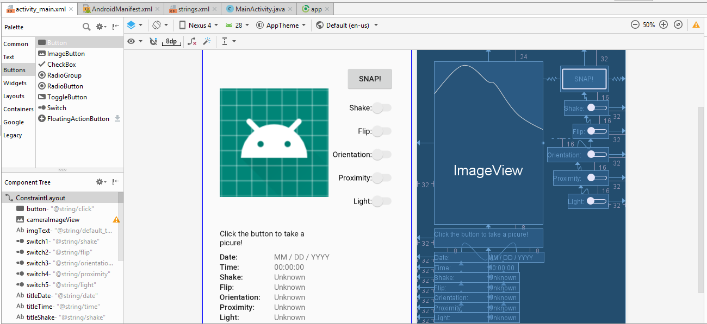
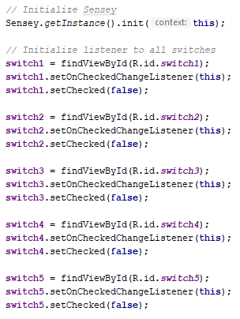
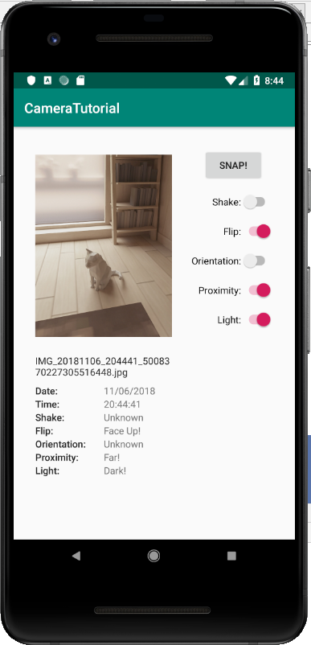

author: Hung Hong
summary: CS4518 Project 2 Implementing Sensor Tutorial
categories: Fragments
environment: java


# CS4518 Project 2 Implementing Sensor Tutorial
## Overview of Tutorial

This tutorial will show you how I go about enriching the data acquisition process through the use of sensor data via third-party sensor lib **Sensey**.

Prerequisites:
- Complete Project 2 - Part 1
- AVD with API 27 or higher and support environment manipulation

## Set up the UI for everything
Before we start on implementing some form of sensor detection into our application, it is best that we know what we are trying to implement so we don't get bombarded with information. In particular, my goal for this part is to make sure the UI is intuitive with relevant information. Thus, I decide to revampt the UI completely so that it can fit new sensor data, which we will talk more about in the latter parts.

Here is my UI redesign, which retains the core function such as imageView and button for accessing the camera. I add many Switches for different sensor option that I want to detect, as well as several textView to make the information displayed nicely.



Make sure that every parameter is defined (e.g. constraints between elements, strings associated to each, ID names, etc...) because this will help a lot later when we try to implement Sensor data and display those information to the UI.

## Add the 3rd-Party Sensor Library to Dependencies
Like I mentioned before, we will be using a 3rd-party Library called **Sensey** for Part 2 as a neat way to obtain Sensor data.
This library is available to be used and accessed easily. All you have to do is to add the following line to the list of dependencies:

```
implementation 'com.github.nisrulz:sensey:1.8.0'
```

There will be a prompt for you to sync up your build.gradle, so just select **Sync Now** and you are good to go.

## Make your application detect Sensor data (Pt.1)
Now that you have granted access to **Sensey**, we can initialize **Sensey** from our main activity. Going to your `MainActivity.java`, add the following line to your `onCreate()`:

```
Sensey.getInstance().init(this);
```

Since you include the aforementioned line in `onCreate()`, make sure that you also stop **Sensey** at your `onDestroy()` by adding the following line:

```
Sensey.getInstance().stop();
```

Make sure you also include this line so your activity recognize **Sensey**

**import com.github.nisrulz.sensey.Sensey;**

Next, you would want to initialize the switches in your `onCreate()` as well. Here is what I included in my project:



As you include these Switches, make sure that you also include `OnCheckedChangeListener` to the activity, or it will shoot an error. You will also need to include `onCheckedChanged()` function in your activity, which will be filled out later. This function will indicate what is going to happen when the switches are toggled.

## Add the 3rd-Party Sensor Library (Pt.2)
Before you move on, make sure you include these lines on top of your activity for several sensor detection functions that you will be using.

```
import com.github.nisrulz.sensey.Sensey;
import com.github.nisrulz.sensey.ShakeDetector.ShakeListener;
import com.github.nisrulz.sensey.FlipDetector.FlipListener;
import com.github.nisrulz.sensey.LightDetector.LightListener;
import com.github.nisrulz.sensey.OrientationDetector.OrientationListener;
import com.github.nisrulz.sensey.ProximityDetector.ProximityListener;
```

You will also need to add on to your `MainActivity` by extending the following:

```
public class MainActivity extends AppCompatActivity
        implements OnCheckedChangeListener, ShakeListener, FlipListener,
        LightListener, OrientationListener, ProximityListener {
...
}
```

Now you are ready to add the appropriate sensor detection function that **Sensey** offers. Go ahead and edit your `onCheckedChanged()` function to start/stop listening to different sensor data as the switch is turned on/off respectively.

```
public void onCheckedChanged(CompoundButton switchBtn, boolean isChecked) {
        switch (switchBtn.getId()) {
            case R.id.switch1:
                if (isChecked) {    // SHAKE
                    shakeVal = 0;
                    Sensey.getInstance().startShakeDetection(10, 2000, this);
                } else {
                    Sensey.getInstance().stopShakeDetection(this);
                    shakeVal = -1;
                }
                break;
            case R.id.switch2:
                if (isChecked) {    // FLIP
                    flipVal = 1;
                    Sensey.getInstance().startFlipDetection(this);
                } else {
                    Sensey.getInstance().stopFlipDetection(this);
                    flipVal = -1;
                }
                break;
            case R.id.switch3:      // ORIENTATION
                if (isChecked) {
                    orientVal = 0;
                    Sensey.getInstance().startOrientationDetection(this);
                } else {
                    Sensey.getInstance().stopOrientationDetection(this);
                    orientVal = -1;
                }
                break;
            case R.id.switch4:      // PROXIMITY
                if (isChecked) {
                    proxVal = 0;
                    Sensey.getInstance().startProximityDetection(this);
                } else {
                    Sensey.getInstance().stopProximityDetection(this);
                    proxVal = -1;
                }
                break;
            case R.id.switch5:      // LIGHT
                if (isChecked) {
                    lightVal = 0;
                    Sensey.getInstance().startLightDetection(10, this);
                } else {
                    Sensey.getInstance().stopLightDetection(this);
                    lightVal = -1;
                }
                break;
            default:                // DO NOTHING
                break;
        }
    }
```

What I did is that as an appropriate switch is turned on, the application will start listening to the gesture that is associated with it. I also include a variable that will control what is being displayed to the UI as a way of keeping track.

As we start listening to different sensor data, it is necessary to also catch any changes as part of sensor detection. Sensey has various associating functions to keep track of changes of different gestures, so I will list down what I used for this project according to what gestures I want to investigate:

**SHAKE**: Detecting whether a shake movement is performed.

```
// SHAKE
    @Override
    public void onShakeDetected() {
        // Shake detected, do something
        shakeVal = 1;
    }

    @Override
    public void onShakeStopped() {
        // Shake stopped, do something
        shakeVal = 0;
    }
```

**FLIP**: Detecting whether the device is facing up or down

```
// FLIP
    @Override
    public void onFaceDown() {
        // Device Facing down
        flipVal = 0;
    }

    @Override
    public void onFaceUp() {
        // Device Facing up
        flipVal = 1;
    }
```

**ORIENTATION**: Determine what orientation the device is held

```
// ORIENTATION
    @Override
    public void onTopSideUp() {
        // Top side of device is up
        orientVal = 0;
    }

    @Override
    public void onBottomSideUp() {
        // Bottom side of device is up
        orientVal = 1;
    }

    @Override
    public void onRightSideUp() {
        // Right side of device is up
        orientVal = 2;
    }

    @Override
    public void onLeftSideUp() {
        // Left side of device is up
        orientVal = 3;
    }
```

**PROXIMITY**: Determine whether the device is held near to or far from the user

```
// PROXIMITY
    @Override
    public void onNear() {
        // Near to device
        proxVal = 0;
    }

    @Override
    public void onFar() {
        // Far from device
        proxVal = 1;
    }
```

**LIGHT**: Determine whether the surrounding is dark or bright

```
// LIGHT
    @Override
    public void onDark() {
        // Dark
        lightVal = 0;
    }

    @Override
    public void onLight() {
        // Not Dark
        lightVal = 1;
    }
```

Congratulation! You have successfully implemented some forms of sensor detection!

## Make your application detect Sensor data (Pt.3)
Now that the sensor detection is applied, we want to display these data to the UI so we can actually see what is going on and make sure that all of these sensors are working as intended. Thankfully, you already implement `onActivityResult()` from Part 1, so you only have to extend the function to display the sensor data as well.

Add these following lines to your `onActivityResult()`, making sure that you link to the correct textViews that you initiated earlier.

```
// Shake
TextView shakeInfo = (TextView) findViewById(R.id.infoShake);
switch (shakeVal) {
    case -1:
        shakeInfo.setText(R.string.unknown);
        break;
    case 0:
        shakeInfo.setText("Shake Stopped!");
        break;
    case 1:
        shakeInfo.setText("Shake Detected!");
        break;
}

// Flip
TextView flipInfo = (TextView) findViewById(R.id.infoFlip);
switch (flipVal) {
    case -1:
        flipInfo.setText(R.string.unknown);
        break;
    case 0:
        flipInfo.setText("Face Down!");
        break;
    case 1:
        flipInfo.setText("Face Up!");
        break;
}

// Orientation
TextView orientInfo = (TextView) findViewById(R.id.infoOrientation);
switch (orientVal) {
    case -1:
        orientInfo.setText(R.string.unknown);
        break;
    case 0:
        orientInfo.setText("Top Side UP!");
        break;
    case 1:
        orientInfo.setText("Bottom Side UP!");
        break;
    case 2:
        orientInfo.setText("Right Side UP!");
        break;
    case 3:
        orientInfo.setText("Left Side UP!");
        break;
}

// Proximity
TextView proxInfo = (TextView) findViewById(R.id.infoProximity);
switch (proxVal) {
    case -1:
        proxInfo.setText(R.string.unknown);
        break;
    case 0:
        proxInfo.setText("Near!");
        break;
    case 1:
        proxInfo.setText("Far!");
        break;
}

// Light
TextView lightInfo = (TextView) findViewById(R.id.infoLight);
switch (lightVal) {
    case -1:
        lightInfo.setText(R.string.unknown);
        break;
    case 0:
        lightInfo.setText("Dark!");
        break;
    case 1:
        lightInfo.setText("Bright!");
        break;
}
```

You should be all set at this point! Feel free to play around with the application to see how it works.

## Final Result
Our final result is an application that can take a picture and detect the environment condition that the picture is taken, depending on which gestures you want to detect by turning on/off the switches accordingly.



Feel free to make the information of the picture to be more detailed, such as when the picture is taken (Which you can easily obtained by applying what you have done from Part 1). One note is that when a certain condition is changed, make sure you turn the appropriate switch off and on again for the gesture that you want to investigate so it can catch the current gesture accurately.

## Summary
In this tutorial, we have accomplished several things:
- Update the UI to accomodate sensor data
- Implement Sensor Detection using 3rd-Party Sensor Library named **Sensey**
- Displaying the information to the UI appropriately