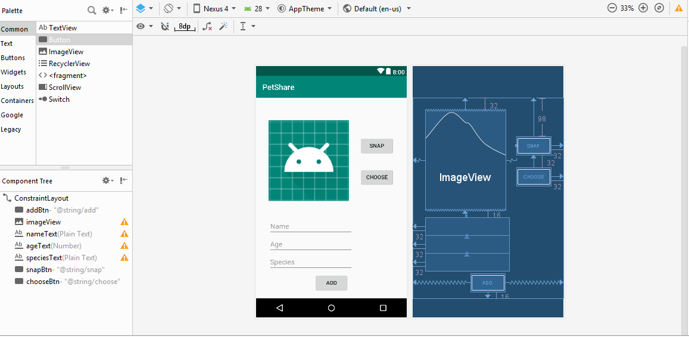
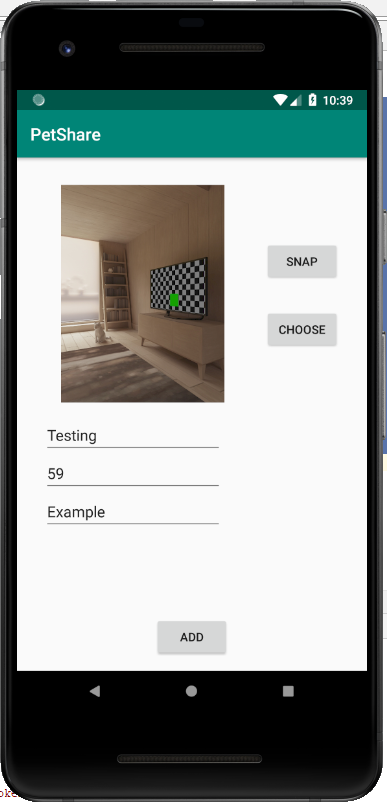
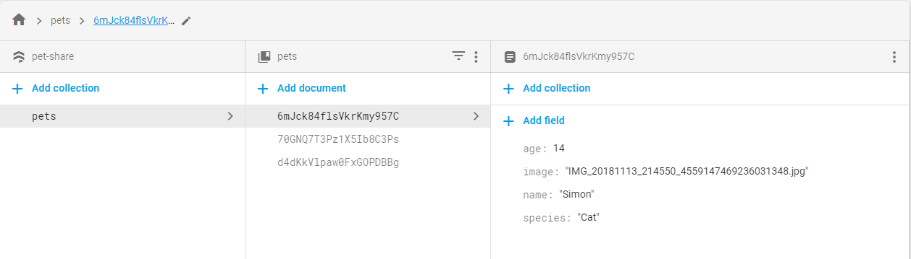
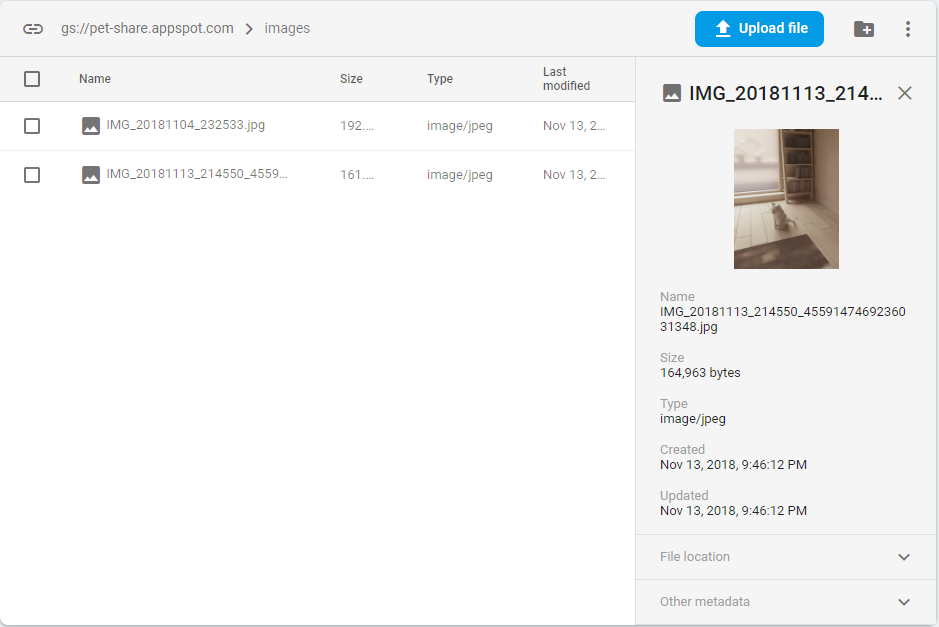

author: Hung Hong
summary: CS4518 Project 3 Using Firebase Database/Storage Tutorial
categories: firebase, database, storage, images
environment: java


# CS4518 Project 3 Using Firebase Database/Storage Tutorial
## Overview of Tutorial

This tutorial will show you how to integrate Firebase into your application for database and storage of information.

Prerequisites:
- Understand the concept from Project 3 - Part 1
- Have Firebase account ready
- AVD with API 27 or higher and support environment manipulation

## Integrate Firebase Library
Assuming you have already made a Firebase account and follow its instruction on how to link Firebase to your application (**Hint:** it has something to do with google-services.json), your next step will be adding the necessary libraries before we start making the application.

Change the view to Project and find **build.gradle**, add the following line under **dependencies**:

```
classpath 'com.google.gms:google-services:4.0.1'
```

Now go to **app > src** and find **build.gradle**, add these following lines under **dependencies:

```
// Firebase
implementation 'com.google.firebase:firebase-firestore:17.1.3'
implementation 'com.google.firebase:firebase-storage:16.0.5'
implementation 'com.google.firebase:firebase-core:16.0.5'
implementation 'com.google.firebase:firebase-auth:16.0.5'
```

At the end of the file, add the following line:

```
apply plugin: 'com.google.gms.google-services'
```

Select **Sync Now** and your project should be connected to Firebase already.

## Add the 3rd-Party Sensor Library to Dependencies
Like I mentioned before, we will be using a 3rd-party Library called **Sensey** for Part 2 as a neat way to obtain Sensor data.
This library is available to be used and accessed easily. All you have to do is to add the following line to the list of dependencies:

```
implementation 'com.github.nisrulz:sensey:1.8.0'
```

There will be a prompt for you to sync up your build.gradle, so just select **Sync Now** and you are good to go.

## Implement the UI
The next thing we want to do is to prepare the UI for this application, though this should not take a long time.

Since we will be using image to upload to Firebase Storage later on, make sure you have ImageView to display the image. Additionally, create several PlainText for data you want to input to the Firebase Database.

Below is my design UI for the application:



You should be all set for the next step, which we will actually start doing some codings

## Making a Class
We will be making a class before editing **MainActivity.java**. Since the application is designed for sharing pet's information, I will create a class called "Pet" so we can use this to upload to the database later on.

Below is my implementation of **Pet.java**. Feel free to edit if you want to have more parameters recorded.

```
public class Pet {
    private String name;
    private int age;
    private String species;
    private String image;

    public Pet() {}
    public Pet(String name, int age, String species, String image) {
        this.name = name;
        this.age = age;
        this.species = species;
        this.image = image;
    }

    public String getName() { return name; }

    public void setName(String name) { this.name = name; }

    public int getAge() { return age; }

    public void setAge(int age) { this.age = age; }

    public String getSpecies() { return species; }

    public void setSpecies(String species) { this.species = species; }

    public String getImage() { return image; }

    public void setImage(String image) { this.image = image; }
}
```

## Preparing data for Firebase
We should be ready to work on **MainActivity.java** right now. Firstly, we should initialize Firebase so we can use Cloud service for our application.

Under **onCreate** function, add these following lines:

```
// Initialize Firestore and the RecyclerView
initFirestore();
initStorage();

// Get a reference to the pet collection
listPet = mFirestore.collection("pets");
```

Then we define these following functions:

```
// Initialize Firestore
private void initFirestore() {
    mFirestore = FirebaseFirestore.getInstance();
}

// Initialize Storage
private void initStorage() {
    storage = FirebaseStorage.getInstance();
    storageReference = storage.getReference();
}
```

## Preparing Image to be uploaded
We will have 2 options for users to upload image: image taken from Camera, or image existing in the external storage.

For image in Camera, feel free to refer to the Camera Tutorial that we have already done in the past. Here is the code snippets for what I did for Camera button:

```
// Button for camera
public void onClickCameraButton(View v) {
    Intent pictureIntent = new Intent(MediaStore.ACTION_IMAGE_CAPTURE);
    if (pictureIntent.resolveActivity(getPackageManager()) != null){
        // Create a file to store the image
        File photoFile = null;
        try {
            photoFile = createImageFile();
        } catch (IOException ex) {
            // Error occurred while creating the File
            return;
        }
        if (photoFile != null) {
            photoURI = FileProvider.getUriForFile(this, "wpi.hphong.petshare.fileprovider", photoFile);
            pictureIntent.putExtra(MediaStore.EXTRA_OUTPUT, photoURI);
            startActivityForResult(pictureIntent, REQUEST_IMAGE_CAPTURE);
        }
    }
}

private File createImageFile() throws IOException {
    String timeStamp = new SimpleDateFormat("yyyyMMdd_HHmmss", Locale.getDefault()).format(new Date());
    String imageFileName = "IMG_" + timeStamp + "_";
    File storageDir = getExternalFilesDir(Environment.DIRECTORY_PICTURES);
    File image = File.createTempFile(
            imageFileName,  /* prefix */
            ".jpg",         /* suffix */
            storageDir      /* directory */
    );
    mCurrentPhotoPath = image.getAbsolutePath();
    mCurrentPhotoName = image.getName();
    return image;
}
```

For image from existing file in the external storage, we will be using Intent, as shown in class and in the textbook.

```
// Button for select image from system
public void onClickChooseButton (View v) {
    Intent intent = new Intent();
    intent.setType("image/*");
    intent.setAction(Intent.ACTION_GET_CONTENT);
    startActivityForResult(Intent.createChooser(intent, "Select Picture"), REQUEST_IMAGE_SELECT);
}
```

Lastly, we make sure that the image is displayed to our ImageView. This should not be new:

```
@Override
protected void onActivityResult(int requestCode, int resultCode, Intent data) {
    ImageView cameraImg = (ImageView) findViewById(R.id.imageView);
    if (requestCode == REQUEST_IMAGE_CAPTURE && resultCode == RESULT_OK) {
        cameraImg.setImageBitmap(BitmapFactory.decodeFile(mCurrentPhotoPath));
    }
    if (requestCode == REQUEST_IMAGE_SELECT && resultCode == RESULT_OK) {
        photoURI = data.getData();
        mCurrentPhotoName = getFileName(photoURI);
        try {
            Bitmap bitmap = MediaStore.Images.Media.getBitmap(getContentResolver(), photoURI);
            cameraImg.setImageBitmap(bitmap);
        }
        catch (IOException e)
        {
            e.printStackTrace();
        }
    }
}
```

Take note that here I use a helper function called **getFileName** to obtain the file name from the URI. This is helpful as I will be making use of the name as part of the information uploaded to the database. Credit to StackOverflow community for this neat function.

```
// Helper function to get file name from URI
public String getFileName(Uri uri) {
    String result = null;
    if (uri.getScheme().equals("content")) {
        Cursor cursor = getContentResolver().query(uri, null, null, null, null);
        try {
            if (cursor != null && cursor.moveToFirst()) {
                result = cursor.getString(cursor.getColumnIndex(OpenableColumns.DISPLAY_NAME));
            }
        } finally {
            cursor.close();
        }
    }
    if (result == null) {
        result = uri.getPath();
        int cut = result.lastIndexOf('/');
        if (cut != -1) {
            result = result.substring(cut + 1);
        }
    }
    return result;
}
```

## One Button to Upload All
One remaining thing is to post the information to Firebase database and storage. Information such as name/age/species will go to the Database, while image resource will go to the Storage. You can always check them on Firebase consoles.

Make a new function to be assigned to the **Add** button, let's call it **onClickAdd()**.

We will need to upload the information to the database. Since we already got a reference to our database collection, we will simply use **add()** to push to the database.

```
// Add pet information to database
TextView name = (TextView) findViewById(R.id.nameText);
TextView age = (TextView) findViewById(R.id.ageText);
TextView species = (TextView) findViewById(R.id.speciesText);
Pet pet = new Pet();
pet.setName(name.getText().toString());
pet.setAge(Integer.parseInt(age.getText().toString()));
pet.setSpecies(species.getText().toString());
pet.setImage(mCurrentPhotoName);
listPet.add(pet);
```

Next, we will upload the actual image resource that we either got it from external file or from camera to our Firebase Storage. Use these following lines which will call to our Storage Reference and push the image files to Storage through **putFile()**

```
// Add pet image to storage
if(photoURI != null)
{
    StorageReference ref = storageReference.child("images/"+ mCurrentPhotoName);
    ref.putFile(photoURI).addOnSuccessListener(new OnSuccessListener<UploadTask.TaskSnapshot>() {
        @Override
        public void onSuccess(UploadTask.TaskSnapshot taskSnapshot) {
            Toast.makeText(MainActivity.this, "Uploaded", Toast.LENGTH_SHORT).show();
        }
    }).addOnFailureListener(new OnFailureListener() {
        @Override
        public void onFailure(@NonNull Exception e) {
            Toast.makeText(MainActivity.this, "Failed "+e.getMessage(), Toast.LENGTH_SHORT).show();
        }
    }).addOnProgressListener(new OnProgressListener<UploadTask.TaskSnapshot>() {
        @Override
        public void onProgress(UploadTask.TaskSnapshot taskSnapshot) {
            double progress = (100.0*taskSnapshot.getBytesTransferred()/taskSnapshot.getTotalByteCount());
            // To be used if needed to check progress
        }
    });
}
```

And with that, you should be all set! Don't forget to add permissions to **AndroidManifest.xml**

```
<uses-permission android:name="android.permission.INTERNET" />
<uses-feature android:name="android.hardware.camera" android:required="true" />
<uses-permission android:name="android.permission.WRITE_EXTERNAL_STORAGE" />
<uses-permission android:name="android.permission.READ_EXTERNAL_STORAGE" />
```

And make sure you add the FileProvider to the Manifest file as well (refer to Project 1)

```
<provider
    android:name="android.support.v4.content.FileProvider"
    android:authorities="wpi.hphong.petshare.fileprovider"
    android:exported="false"
    android:grantUriPermissions="true">
    <meta-data
        android:name="android.support.FILE_PROVIDER_PATHS"
        android:resource="@xml/filepaths"></meta-data>
</provider>
```

## Final Result
Our final result is an app that can take in users' input and image resource and push them to Firebase Cloud Service so others can view them on other devices.



You can actually go to your Firebase project and see these information yourself. For example, my Database contains following information that I pushed during my testing:



The images are uploaded to the Storage instead, and you can also view them to confirm that your image has been published to the Cloud.



## Summary
In this tutorial, we have accomplished several things:
- Link project to Firebase libraries
- Use Camera and Intent for images
- Publish information to Firebase Cloud Services.