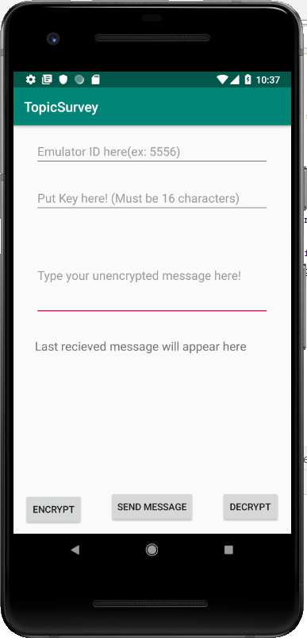
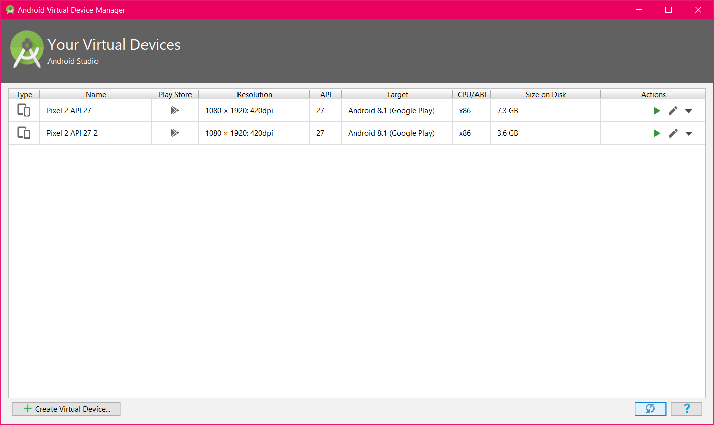
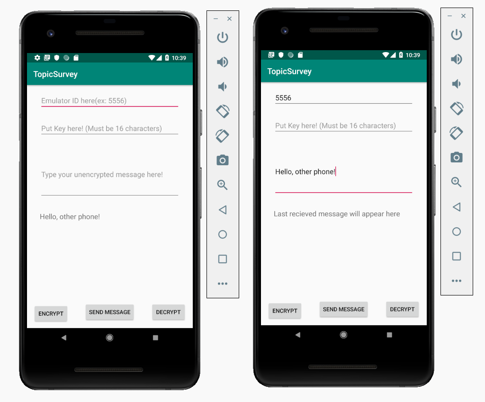
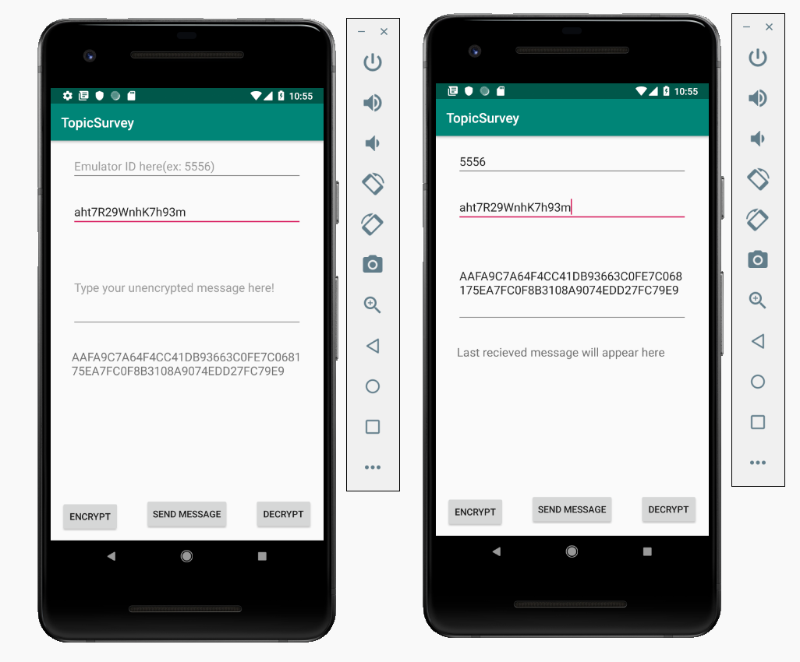
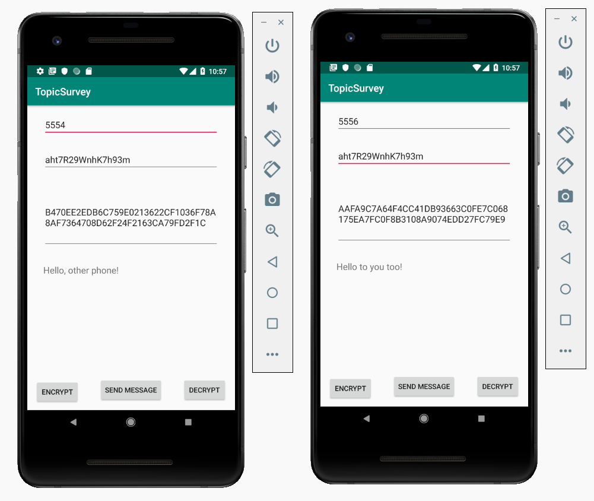

author: Hannah Jauris, Hung Hong
summary: CS4518 Topic Survey - Intro to Encryption in Android
categories: cryptography, encryption, decryption, sms
environment: java


# CS4518 Topic Survey - Intro to Encryption in Android
## Overview of Tutorial
In this tutorial, we will show you the basics of encryption and decryption of messages using the Advanced Encryption Standard (AES) algorithm.

Prerequisites:
AVD with API 27 or higher and support environment manipulation
SMS_Encrypt Starter Code (provided by us)


## Open Starter Code
Before we begin, you will need the following starter code for the application named SMS_Encrypt. You can download it here: https://drive.google.com/file/d/1z0O71QV0Y98bYuvV9B-pZRwSJSYP04uU/view?usp=sharing 

In this starter code, we have already set up the functionality to send SMS to other devices. The starter code’s UI consists of two editable text fields that allow you to type in messages and the number of the emulator you want to send a message to, a button to send the message in the message field, and two buttons for encryption and decryption which currently do not do anything. It also contains a text field where users can enter a key used to encrypt and decrypt messages.



Let’s test the starter code by running the application on 2 devices at the same time, which we will show you on the next step.

## Setup Testing Environment
First, open AVD Manager. We assume you already have one virtual device set up. Create another one with similar settings to the first, using the `Create Virtual Device…` button in the lower left of the AVD manager. **DO NOT DUPLICATE** your existing device, as it may not allow you to open both of those virtual devices at the same time.



Next, we will run the application on both devices, and test sending a message from one to the other.

The device number can be seen when you choose the devices to open. (You can also find this number by going to `...` on the emulator’s side menu, then `Help -> About` and finding the number under the serial number field.)  By default, the numbers are 5554 and 5556. Test the application by entering the recipient device number and a message to be sent. Press Send once you are done. You should see the message being received, unencrypted, on the other device:



## Encryption
### Preparation
First, make a function that the Encrypt button would call upon being clicked. Give it a helpful name such as `encrypt`.

When the user clicks the button, we want to encrypt the message they have written. Get the text contained in the message field (its id in the view is `messageText`), and the key string from its field (its id in the view is ‘keyText’). The encryption we are using requires keys to be exactly 16 characters long, so make sure to check for this when you get the key value!

Feel free to extend the function by dealing with different circumstances, e.g. text field is empty. You can use Toast to inform the user that a certain text field should be filled, or you can simply allow an empty string to be encrypted.

### Cipher
Now that we have the information from the UI, the next step is to get a `Cipher` object. To do this, we call `Cipher.getInstance` and store the result in a Cipher variable.
 
The version of `getInstance` we use has a single parameter, `String transformation`, which indicates what type of encryption we want to perform. Since we are performing AES, pass in `”AES”`. 

```
Cipher cipher = Cipher.getInstance("AES");
```

**Note:** If you are curious about the different types of encryption available to use, they are listed here: https://developer.android.com/reference/javax/crypto/Cipher 

Next, we need to create our key, using the string we stored for it. Create an object of type `SecretKey`, and initialize it with `new SecretKeySpec`, passing in the bytes of the text from the key UI field and our algorithm, `”AES”`.

Now we need to initialize our Cipher object so that it is ready to perform encryption. To do this, we call the `init` function.

This method has two parameters: `int opmode` and `Key key`. The first one is what we will use to tell the object to encrypt the string, rather than decrypt it. We pass the `Cipher.ENCRYPT_MODE` constant into this field. For the key, provide the SecretKey you just created.

```
SecretKey key = new SecretKeySpec(keyString.getBytes(), "AES");
cipher.init(Cipher.ENCRYPT_MODE, key);
```

Now our Cipher object is all set to start encrypting, and we can perform the actual encryption. This can be done using our Cipher’s `doFinal` method.

```
byte[] output = cipher.doFinal(message.getBytes());
```

We will pass in a single parameter, the string of our message text we retrieved earlier, also calling `.getBytes()` on it to get it into the proper `byte[]` parameter type. `doFinal` returns a byte array of the output, so we should store that in a variable.

We are all done encrypting! However, since we want to send this over SMS, we have one additional step to make. When sending over SMS, the message is sent as a String. However, turning the byte array into a String, and then attempting to turn it back into a byte array to decrypt, can cause problems.

We will need to implement two functions, `byte2hex` and `hex2byte`, which will convert the already encrypted bytes into hex values and vice versa. These hex values are stored as a string, making it possible for us to send and receive the string, then return it to its proper byte array when decrypting. The code for these functions are shown below:

```
private static String byte2hex(byte[] b) {
        String hs = "";
        String stmp = "";
        for (int n = 0; n < b.length; n++) {
            stmp = Integer.toHexString(b[n] & 0xFF);
            if (stmp.length() == 1)
                hs += ("0" + stmp);
            else
                hs += stmp;
        }
        return hs.toUpperCase();
}
private static byte[] hex2byte(byte[] b) {
        if ((b.length % 2) != 0)
            throw new IllegalArgumentException("hello");
        byte[] b2 = new byte[b.length / 2];
        for (int n = 0; n < b.length; n += 2) {
            String item = new String(b, n, 2);
            b2[n / 2] = (byte) Integer.parseInt(item, 16);
        }
        return b2;
}
```

Call `byte2hex` and pass in the results of our encryption, then use `setText()` on the EditText field for the message to update the message text with the encrypted, hex-ified version of it. We can now send encrypted messages!



**Note**: There are many ways to implement the functions `getInstance`, `init`, and `doFinal`, i.e. different numbers and types of parameters to use. Check it out on https://developer.android.com/reference/javax/crypto/Cipher if you are interested to learn more to apply to various situations.

**Note**: We use the helper functions `hex2byte` and `byte2hex` for our application, which turns byte arrays into a readable form. If we were not storing the encrypted fields in strings, this would not be necessary.

## Decryption
Decrypting is going to be very similar to encrypting. First, we want a method that is called when we click the “Decrypt” button, with a helpful name such as `decrypt`. However, unlike the encrypt method, we are going to be accessing the text field with the view id `receivedMessage`, since we want to decrypt the messages that have been sent to us.

The code is very similar to the `encrypt` function we created in the last step. We get our Cipher object instance in the same way, as well as the key, and we also call the `init` method, with one important difference: we want to pass in `Cipher.DECRYPT_MODE` so it will decrypt our text rather than encrypt it!

```
cipher.init(Cipher.DECRYPT_MODE, key);
```

Remember when we used `byte2hex` to convert the byte array to a string-friendly format? Now that we need to access the message as a byte array again, we need to call `hex2byte` to return the received to its original format before we decrypt it.

We also call the `doFinal` method again, passing in our received message as a byte array and storing the output in a new byte array variable.

```
byte[] bytes = hex2byte(message.getBytes());
byte[] decr = cipher.doFinal(bytes);
```

We can then update the `receivedMessage` text field to show our decrypted message.

## Result
As discussed in the previous sections, our application can perform simple SMS functionality, in particular sending and receiving SMS message between devices. We can test our results by sending the encrypted message from one device to another. On the receiving device, make sure to enter the same key that we use for encryption to decrypt the message. We should obtain the original message as a result.



## Summary
In this tutorial, we have accomplished several goals, in particular:
Make use of SMS functionality
Encryption of outgoing message
Decryption of incoming message

There are many ways you can make use of encryption and decryption knowledge in Android development. We hope our basic walkthrough can give you a fundamental understanding of how it works so you can apply the skills on your own application in the future!

## References
We used these resources when learning how to perform encryption as well as how to send SMS messages for creating our tutorial:
- https://sites.google.com/site/mobilesecuritylabware/3-data-location-privacy/lab-activity/cryptography/cryptography-mobile-labs/encryption-decryption/2-lab-activity/lab-1-encryption-decryption-on-sms-android-studio
- https://mobiforge.com/design-development/sms-messaging-android 
- https://developer.android.com/reference/javax/crypto/Cipher 